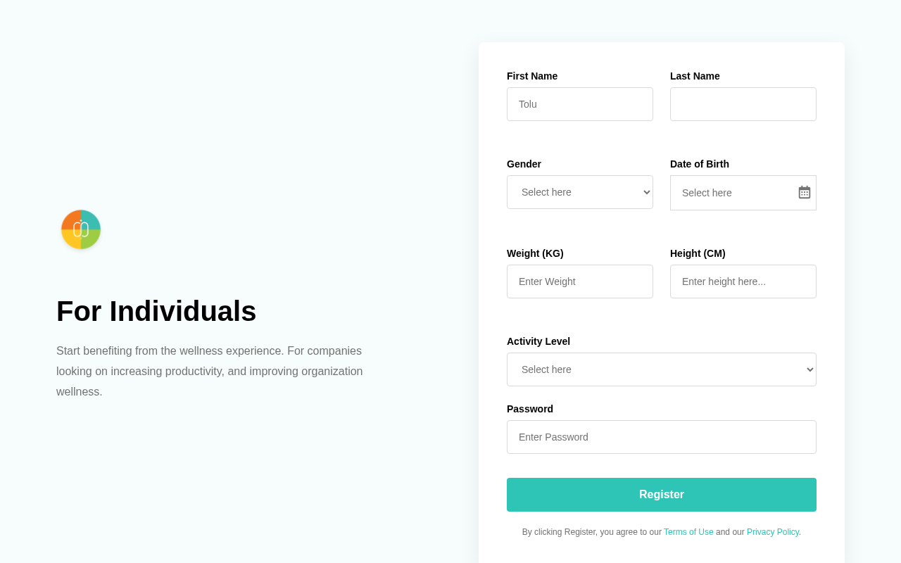

# Sign Up Form

A responsive sign-up form built with **HTML, CSS, and JavaScript**. This project recreates a modern Figma design while implementing real-time form validation and an enhanced date picker using Flatpickr.

## Features

- Responsive two-column layout
- Clean and modern user interface
- Real-time form validation
- Password validation
- Custom date picker with Flatpickr
- User-friendly error messages
- Accessible form structure

## Built With

- HTML5
- CSS3
- JavaScript (ES6)
- Flatpickr

## Live Demo

https://xinfinitygen.github.io/login-ui-design/

## Screenshot



## Getting Started

1. Clone the repository

```bash
git clone https://github.com/Xinfinitygen/login-ui-design.git
```

2. Navigate to the project folder

```bash
cd your-repository
```

3. Open `index.html` in your browser.

## Folder Structure

```
project-folder/
│
├── assets/
│   └── images/
├── styles/
│   └── styles.css
├── script.js
├── index.html
└── README.md
```

## Future Improvements

- Add form submission to a backend
- Implement password visibility toggle
- Improve accessibility
- Add dark mode

## Author

**Okechukwu Promise Ezekiel**

GitHub: https://github.com/Xinfinitygen

## License

This project is for learning and educational purposes.